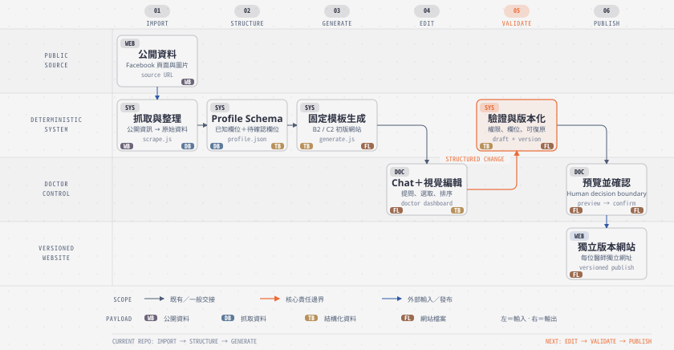

# professionalAiWebsite-map

`professionalAiWebsite` 的產品與技術 mental map。目標是快速回答三件事：產品想做什麼、交接 repo 做到哪裡、接手後由我負責什麼。

> 現況快照：2026-08-17。Demo、部署或生成成功不等於產品效果證明。

## Product Intent

[開啟 SVG 原圖](docs/diagrams/product-editing-flow.svg)

一句話：把「一次性自動建站 Demo」推進成「醫師可自行維護的 AI-assisted Website CMS」。

## 現有 Repo 做到哪裡

上圖的 `IMPORT → STRUCTURE → GENERATE` 是現有 repo 已完成的主路徑；`EDIT → VALIDATE → PUBLISH` 是下一階段要補上的產品能力。

| 已確認能力 | 現有限制 |
|---|---|
| Facebook URL 可生成網站 | 風格與資訊架構固定 |
| B2 / C2 兩種模板 | 資料分類與專科視覺可能錯配 |
| Web UI、進度與失敗 fallback | 生成會覆寫共用資料與網址 |
| Docker / Google Cloud Run | 沒有獨立 site、登入與後台 |
| RWD、掛號連結、醫療免責 | 沒有 draft / preview / publish / rollback；runtime 沒有 LLM / Chat editing |

詳細技術盤點：[docs/current-state.md](docs/current-state.md)

## 我的責任範圍

| 類型 | 本階段內容 |
|---|---|
| Explore | Chat / Visual / Hybrid、可修改內容與版面、模板自由度、Facebook 匯入方式 |
| Optimize | 資料清洗與 profile、專科視覺規則、模板元件化、測試／QA／部署穩定性 |
| Create | 醫師登入與權限、獨立 site project、Website CMS、Preview／Publish／Rollback、AI editing layer |

本階段不處理商業模式、定價、付費意願或曝光成效。

詳細責任與候選架構：[docs/ownership-scope.md](docs/ownership-scope.md)

## 目標方向

上圖同時標示責任邊界：AI／編輯介面負責把需求轉成結構化修改；確定性系統負責驗證、生成與版本保存；醫師保留預覽及確認發布的決定權。

## 建議順序

1. **Site isolation**：獨立資料、素材與網址
2. **Editable data**：Schema、表單、圖片、預覽發布
3. **Component system**：Section、theme、layout、專科規則
4. **AI-assisted editing**：Chat → structured changes → preview → publish
5. **Reliability**：權限、版本復原、測試與監控

## 來源

- 交接 repo：<https://github.com/william-agent/professionalAiWebsite>
- 線上 Demo：<https://social2site-dev-557076811903.asia-east1.run.app/>
- 交接簡報：`專業人士網站.pdf`
