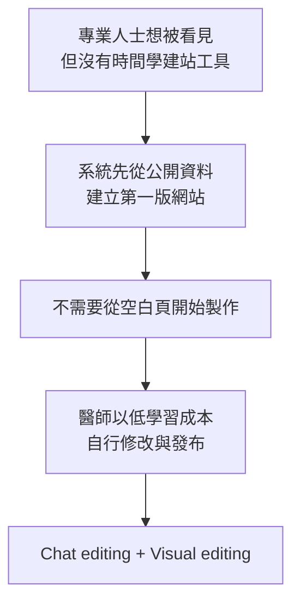
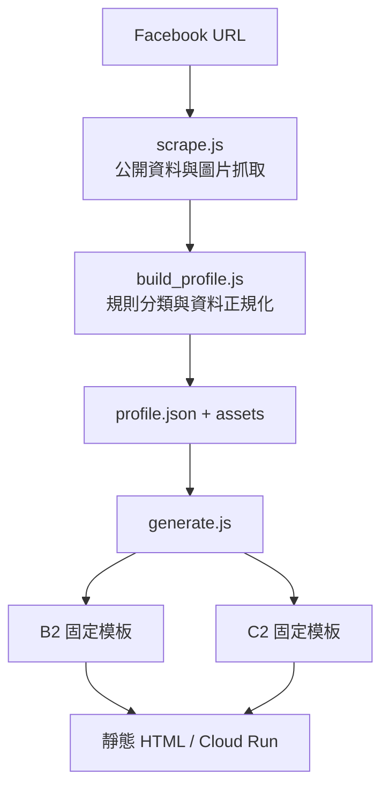
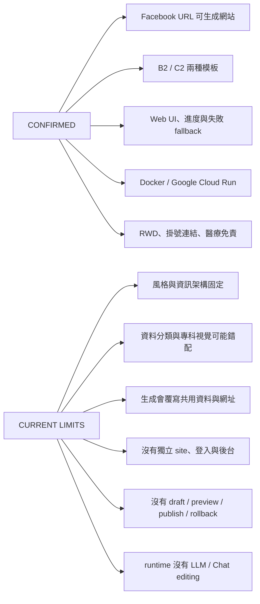
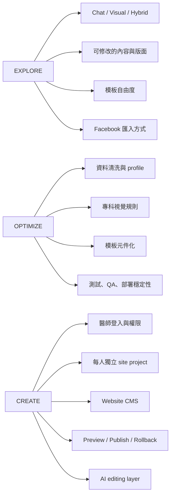
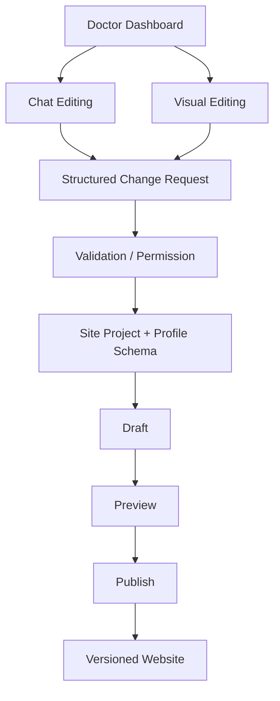
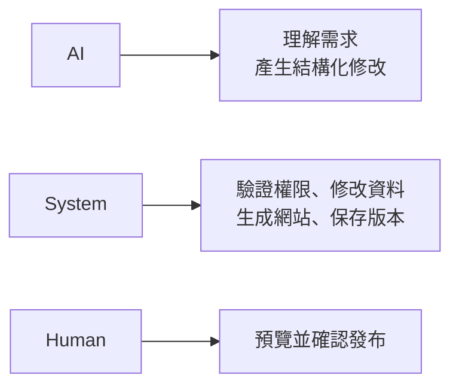
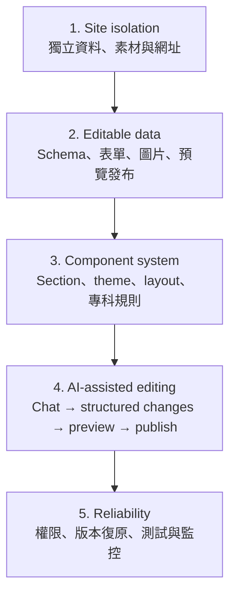

# professionalAiWebsite-map

`professionalAiWebsite` 的產品與技術 mental map。目標是快速回答三件事：產品想做什麼、交接 repo 做到哪裡、接手後由我負責什麼。

> 現況快照：2026-08-17。Demo、部署或生成成功不等於產品效果證明。

## Product Intent

一句話：把「一次性自動建站 Demo」推進成「醫師可自行維護的 AI-assisted Website CMS」。

## 現有 Repo 做到哪裡

詳細技術盤點：[docs/current-state.md](docs/current-state.md)

## 我的責任範圍

本階段不處理商業模式、定價、付費意願或曝光成效。

詳細責任與候選架構：[docs/ownership-scope.md](docs/ownership-scope.md)

## 目標方向

## 建議順序

## 來源

- 交接 repo：<https://github.com/william-agent/professionalAiWebsite>
- 線上 Demo：<https://social2site-dev-557076811903.asia-east1.run.app/>
- 交接簡報：`專業人士網站.pdf`
