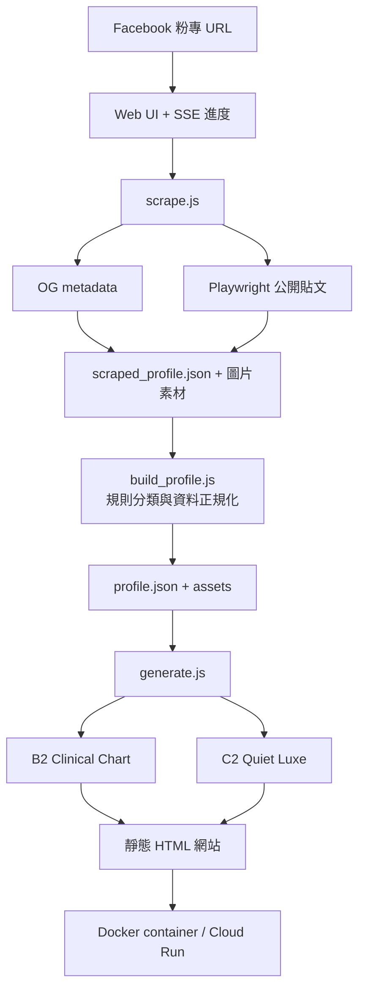
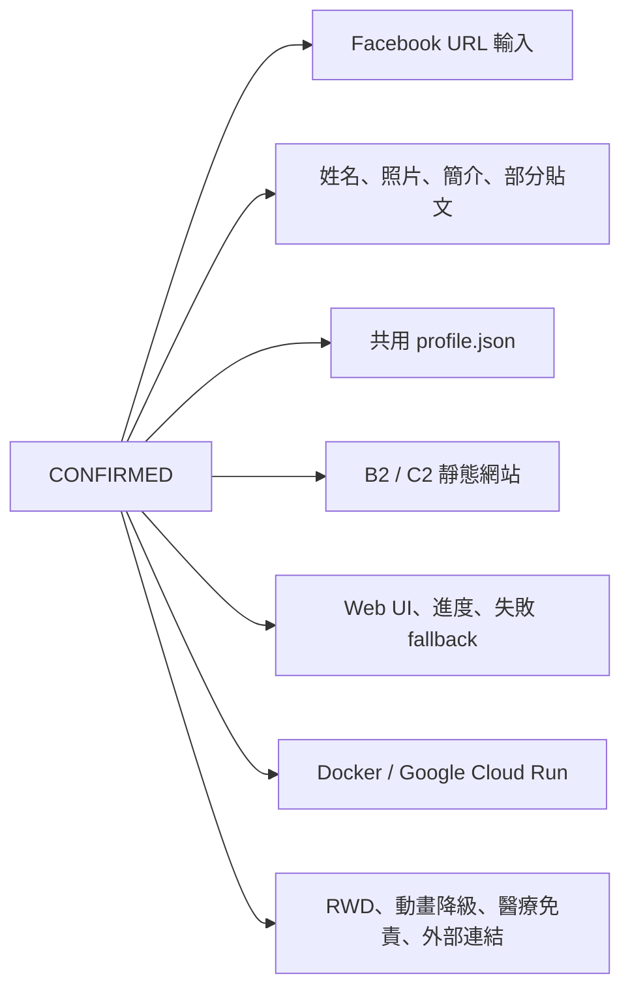
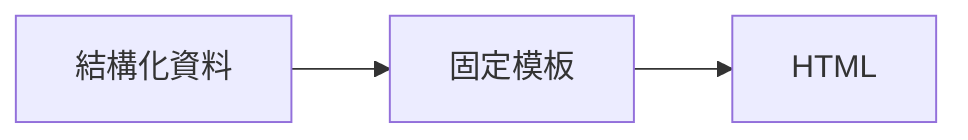
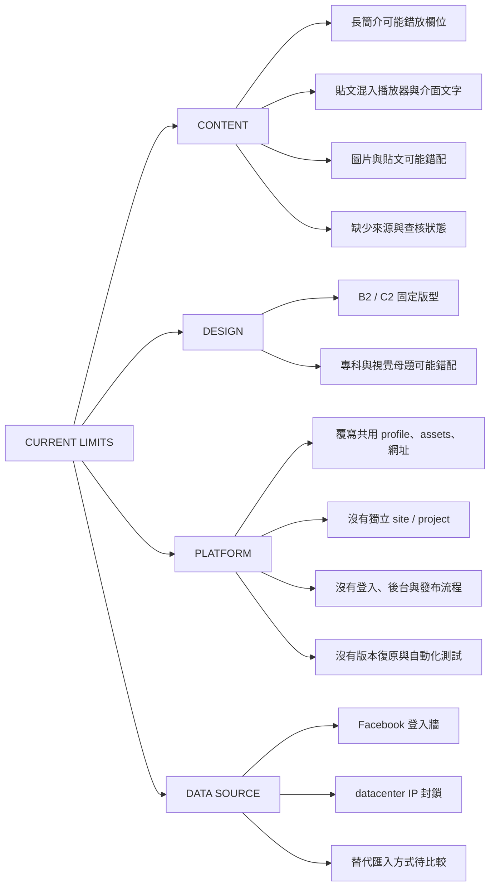
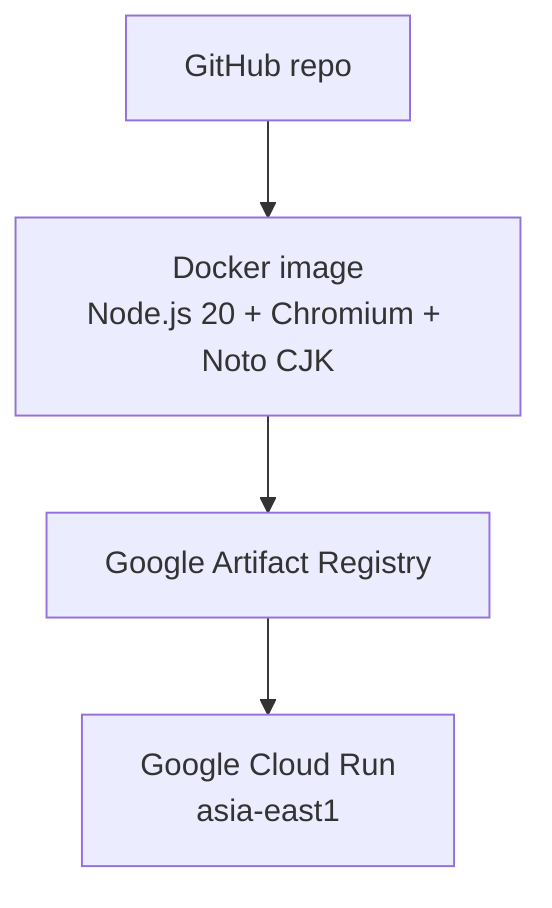

# 現況技術盤點

這份附錄回答：交接 repo 現在怎麼運作、已完成什麼、主要限制在哪裡。

## 執行流程

抓取失敗時，系統改為顯示預先生成的網站，確保 Demo 不會中斷。

## 已完成能力

目前主要是確定性自動化：

runtime 沒有 LLM 動態理解醫師特色、設計網站或執行自然語言修改。

## 已知限制

目前 `/sites/b2/index.html` 與 `/sites/c2/index.html` 代表最新一次生成結果，不是永久保存的個別醫師網站。

## 部署

## 現況來源

- <https://github.com/william-agent/professionalAiWebsite>
- <https://social2site-dev-557076811903.asia-east1.run.app/>
- 2026-08-17 高銘鴻醫師 B2 / C2 試跑結果
