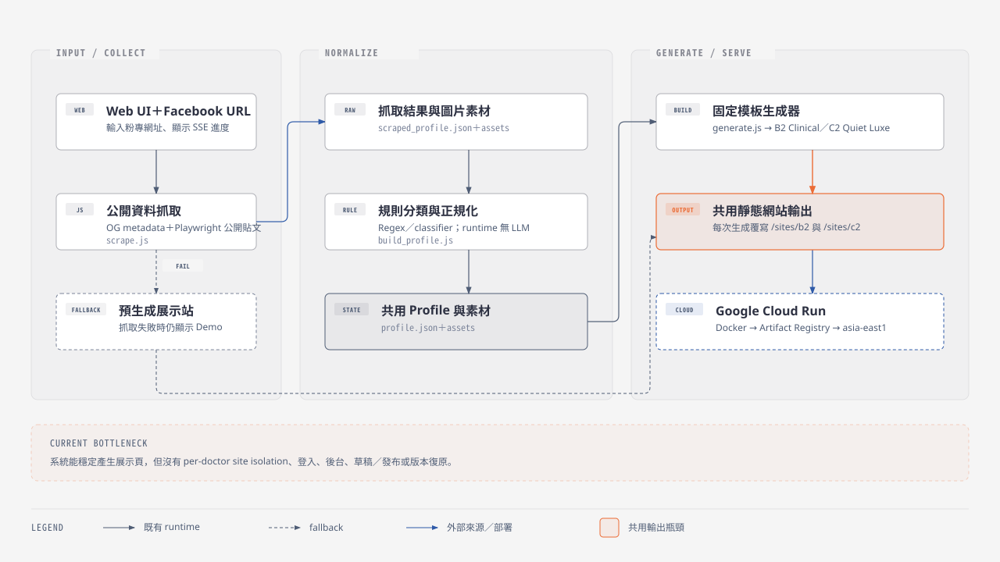

# 現況技術盤點

這份附錄回答：交接 repo 現在怎麼運作、已完成什麼、主要限制在哪裡。

## 執行流程

[開啟 SVG 原圖](diagrams/current-repo-architecture.svg)

抓取失敗時，系統改為顯示預先生成的網站，確保 Demo 不會中斷。

## 已完成能力

| 已確認能力 | 現況 |
|---|---|
| 輸入與抓取 | Facebook URL；姓名、照片、簡介與部分公開貼文 |
| 共用資料 | `profile.json` 與素材目錄 |
| 生成輸出 | B2 / C2 靜態網站 |
| Demo 保險絲 | Web UI、SSE 進度、抓取失敗 fallback |
| 部署 | Docker / Google Cloud Run |
| 前台基礎 | RWD、動畫降級、醫療免責與外部連結 |

目前主要是確定性自動化：

`結構化資料 → 固定模板 → HTML`

runtime 沒有 LLM 動態理解醫師特色、設計網站或執行自然語言修改。

## 已知限制

| 類別 | 已知限制 |
|---|---|
| Content | 長簡介可能錯放欄位；貼文可能混入播放器／介面文字；圖片與貼文可能錯配；缺少來源與查核狀態 |
| Design | B2 / C2 固定版型；專科與視覺母題可能錯配 |
| Platform | 覆寫共用 profile、assets 與網址；沒有獨立 site / project；沒有登入、後台、發布流程、版本復原與自動化測試 |
| Data Source | Facebook 登入牆與 datacenter IP 封鎖；替代匯入方式仍待比較 |

目前 `/sites/b2/index.html` 與 `/sites/c2/index.html` 代表最新一次生成結果，不是永久保存的個別醫師網站。

## 部署

部署路徑已整合在上方架構圖：`GitHub repo → Docker image（Node.js 20＋Chromium＋Noto CJK）→ Google Artifact Registry → Google Cloud Run（asia-east1）`。

## 現況來源

- <https://github.com/william-agent/professionalAiWebsite>
- <https://social2site-dev-557076811903.asia-east1.run.app/>
- 2026-08-17 高銘鴻醫師 B2 / C2 試跑結果
