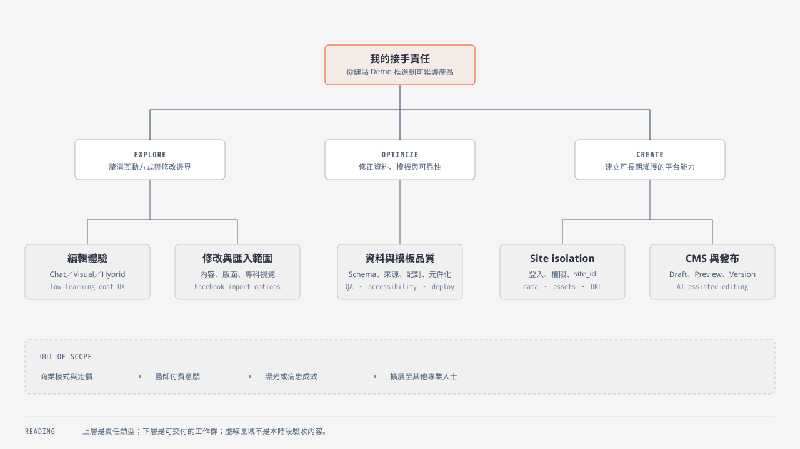
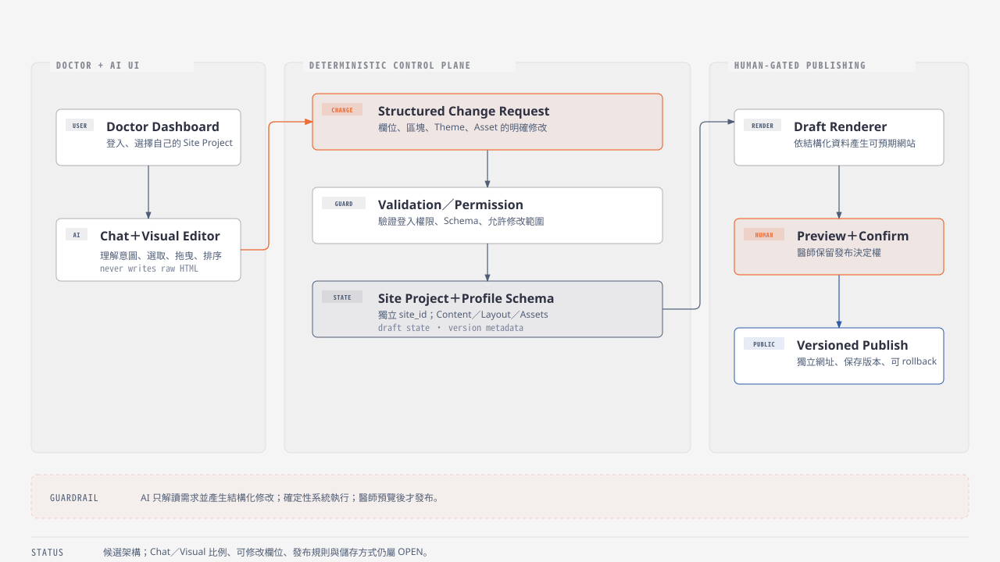

# 接手責任與探索範圍

這份附錄回答：哪些事情可以探索、哪些沿用現況優化、哪些需要新建。

## Decision Boundary

[開啟 SVG 原圖](diagrams/ownership-scope-map.svg)

## Explore

| 探索題 | 候選範圍 |
|---|---|
| 編輯模式 | Chat-first / Visual-first / Hybrid |
| 常見修改內容 | 門診時間、主圖與形象照、專長、經歷、衛教文章、區塊順序 |
| 版面自由度 | Theme、Section 順序、Layout / component variant |
| 專科視覺 | 不同專科的內容與視覺語言 |
| Facebook 匯入 | 公開頁抓取、Meta 授權、後台手動匯入 |

## Optimize

| 優化面向 | 內容 |
|---|---|
| Data | 資料清洗、欄位分類、Profile schema、來源與人工查核標記、貼文與圖片配對 |
| Content / Design | 專科內容與視覺規則、B2 / C2 模板元件化 |
| Quality | 手機與無障礙體驗、錯誤處理、測試與 QA |
| Operations | 部署與效能 |

浮動 IP、VPN 或代理池只是 Facebook 抓取的候選方案之一，不預設為答案。需要與 Meta API、使用者授權及手動匯入比較穩定性、維護成本與平台規範。

## Create

| 新建能力 | 內容 |
|---|---|
| Authentication | 醫師登入；管理者／醫師權限 |
| Site Project Model | 獨立 `site_id`；獨立資料、素材與網址 |
| Website CMS | 文字與圖片修改；區塊開關與排序；Theme / layout |
| Publishing Workflow | Draft / preview / publish；Version rollback |
| AI Editing Layer | 理解自然語言；轉成結構化修改；驗證欄位並交由醫師確認發布 |

## 目標架構候選

[開啟 SVG 原圖](diagrams/target-editor-architecture.svg)

不讓 AI 直接任意重寫整份 HTML，才能保留穩定性、版本控制與可復原性。

這是候選架構，不是已決規格。AI 負責理解醫師想改什麼；確定性系統負責驗證、修改結構化資料、生成網站與保存版本；醫師保留預覽及確認發布的決定權。

## 尚待決定

| OPEN decision | 尚待決定 |
|---|---|
| Editing UX | Chat-first / Visual-first / Hybrid |
| Edit contract | 允許修改的欄位與版面 |
| Publishing | Preview / publish 規則；醫療內容人工確認範圍 |
| URL | 網址與網域策略 |
| Rendering | 是否保留靜態 HTML |
| Storage | Profile / site project 儲存方式 |
| Import | Facebook 同步或首次匯入 |
