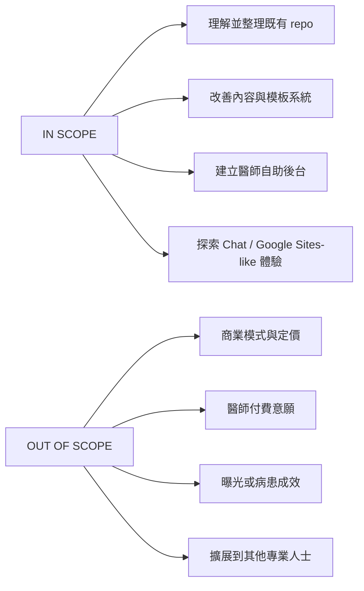
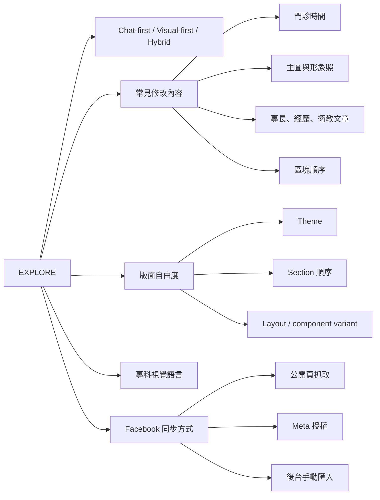
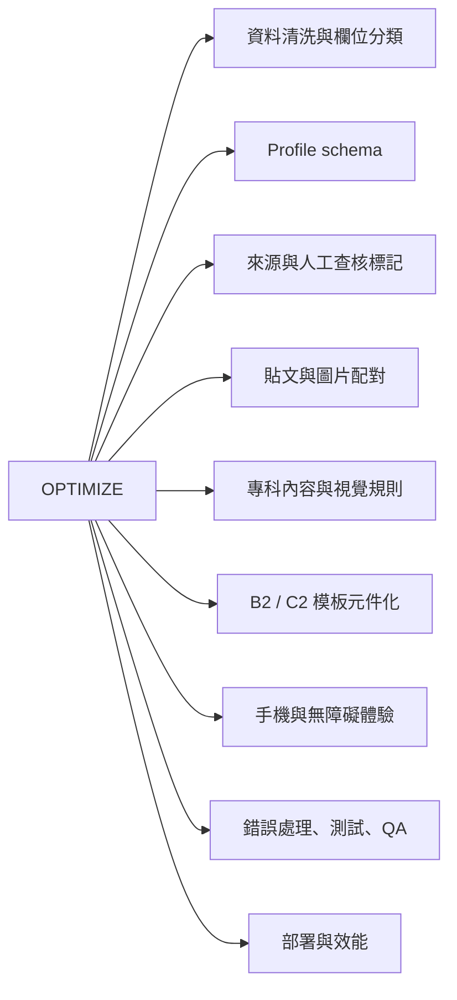
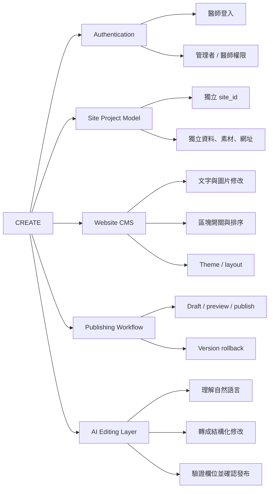
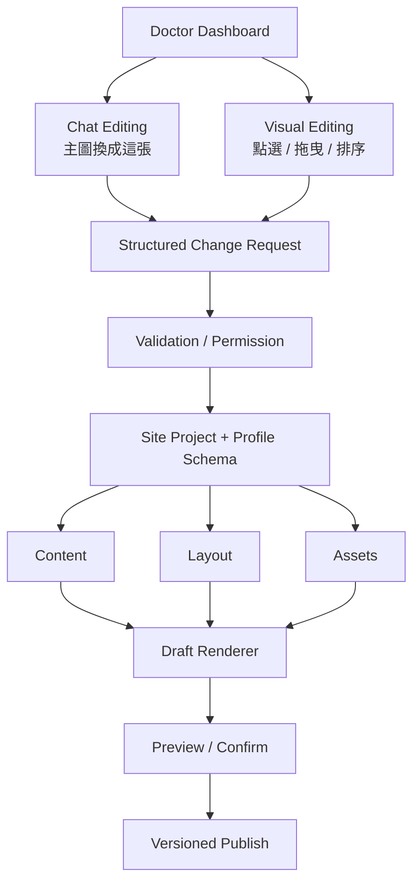
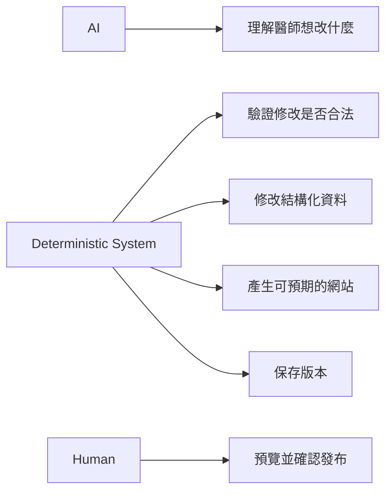
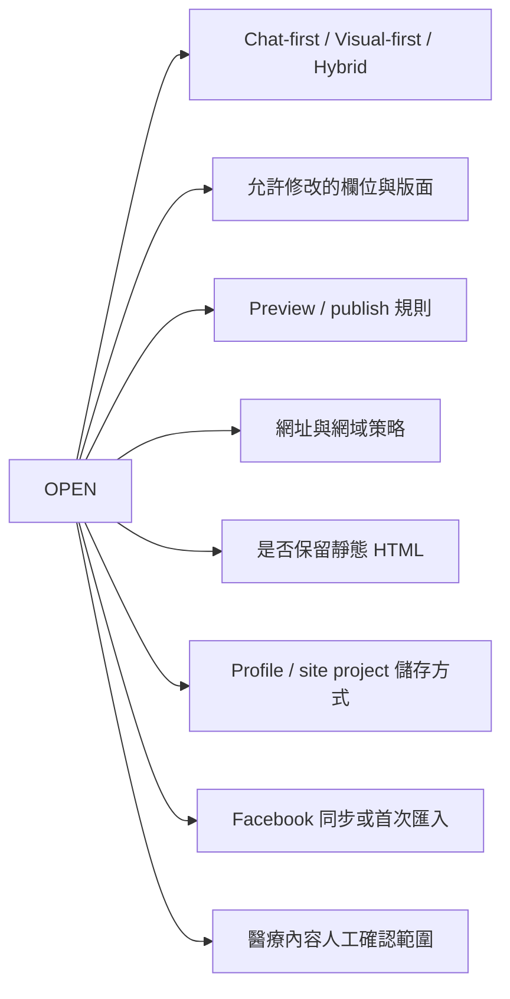

# 接手責任與探索範圍

這份附錄回答：哪些事情可以探索、哪些沿用現況優化、哪些需要新建。

## Decision Boundary

## Explore

## Optimize

浮動 IP、VPN 或代理池只是 Facebook 抓取的候選方案之一，不預設為答案。需要與 Meta API、使用者授權及手動匯入比較穩定性、維護成本與平台規範。

## Create

## 目標架構候選

不讓 AI 直接任意重寫整份 HTML，才能保留穩定性、版本控制與可復原性。

## 尚待決定

